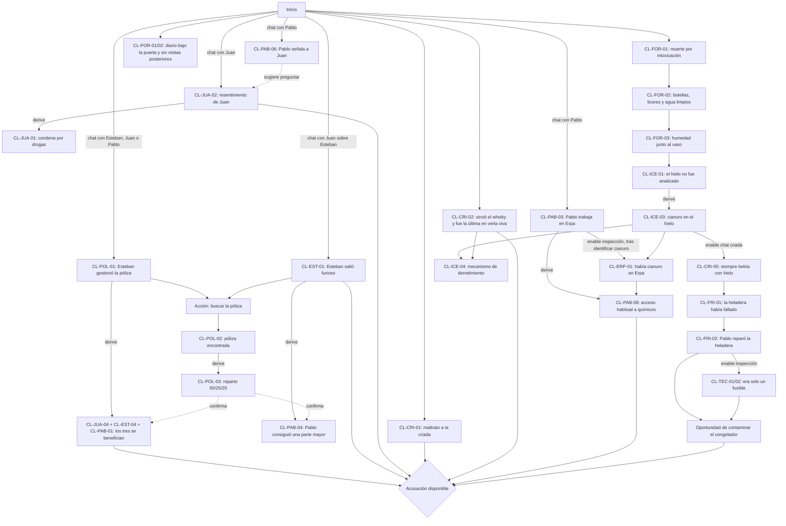

# Hechos, pistas y estado narrativo

## Principio de diseño

El progreso no es una lista lineal de pantallas. El corpus registra muchos hechos atómicos, mientras el tablero muestra solamente las pocas pistas importantes para acusar. Las ramas de sospecha sobre la criada, Juan, Esteban y Pablo pueden recorrerse en distinto orden; la cadena forense sí impone una secuencia parcial.

Se separan tres niveles:

- **Hecho interno (`CL-*`):** dato granular recuperable o derivable. El prefijo histórico `CL` se conserva como *claim*, pero estos IDs no aparecen individualmente en el tablero.
- **Pista visible (`PI-*`):** agrupación jugable de uno o más hechos. Solo estas pistas cuentan para habilitar una acusación.
- **Hito (`M*`):** resumen calculado de una etapa global de la investigación.

El estado autoritativo pertenece al juego. El modelo no decide qué existe, qué se desbloquea, si una acusación es válida ni quién es culpable.

## Normalización del diagrama original

El diagrama es la autoridad primaria. A partir de él se corrigió el cuento para establecer que:

1. la criada fue la última persona que vio viva a la señora Stevens; el portero dejó el diario bajo la puerta y no la vio;
2. Juan fue condenado y, según él, delatado por Stevens siete años atrás; no necesariamente estuvo siete años preso;
3. Pablo trabaja en la sección de químicos de Erpa y tiene acceso habitual a distintos reactivos;
4. Pablo efectivamente logró que Stevens dispusiera una parte mayor de su dinero para él;
5. el primer testimonio de Esteban ya establece que los tres hermanos son beneficiarios de la póliza, aunque sus porcentajes solo se verifican al encontrarla.

Las flechas rojas rotuladas **DESBLOQUEA** son derivaciones inmediatas, tal como indica el diagrama: al registrar el hecho de origen también se registran sus hechos derivados, sin otra consulta ni acción del jugador. Los enlaces rotulados “por chat con…”, “por encontrar…” o equivalentes son condiciones de acceso (`enable`) y sí requieren esa interacción.

## Grafo normalizado



El grafo muestra dependencias conceptuales. La condición exacta del botón se define más abajo y no exige completar toda la cadena central.

## Derivaciones inmediatas de hechos

Esta tabla es la traducción ejecutable de todas las flechas rojas. Se aplica hasta alcanzar cierre transitivo y de forma idempotente.

| Hecho de origen | Hechos registrados inmediatamente | Motivo |
|---|---|---|
| `CL-JUA-02` | `CL-JUA-01` | el mismo relato del rencor identifica la condena que Juan atribuye a Stevens |
| `CL-POL-01` | `CL-JUA-04`, `CL-EST-04`, `CL-PAB-01` | Esteban declara que los tres son beneficiarios |
| `CL-EST-01` | `CL-PAB-04` | el favoritismo hacia Pablo es la causa declarada de la furia |
| `CL-POL-02` | `CL-POL-03` | encontrar y leer el documento es una única interacción |
| `CL-ICE-01` | `CL-ICE-03` | el análisis rápido sucede automáticamente en la ficción |
| `CL-PAB-03` | `CL-PAB-08` | trabajar en la sección de químicos implica su acceso habitual declarado |

Las derivaciones no ejecutan retrieval, no agregan prosa al prompt y todavía no implican necesariamente una nueva pista visible. Registran hechos estructurados; después, el agregador del tablero evalúa si esos hechos completan alguna `PI-*`.

## Hitos globales

Los hitos resumen únicamente la cadena forense principal. Se calculan a partir de hechos, pistas visibles y acciones; no se guardan como una segunda verdad independiente.

| Hito | Condición | Efecto principal |
|---|---|---|
| `M00_CASE_OPEN` | partida iniciada | habilita escena del crimen y entrevistas iniciales |
| `M10_POISONING_CONFIRMED` | `CL-FOR-01` | establece que se investiga un envenenamiento |
| `M20_LIQUIDS_CLEARED` | `CL-FOR-02` | habilita la búsqueda de una vía no presente en botellas o agua |
| `M30_ICE_HYPOTHESIS` | `CL-ICE-01` | dispara inmediatamente el análisis narrativo y deriva `CL-ICE-03` |
| `M40_POISON_IN_ICE` | `CL-ICE-03` | habilita preguntas sobre el hábito de consumo y la heladera |
| `M50_PABLO_FRIDGE_LINK` | `CL-FRI-02` | habilita inspección técnica y confrontación específica a Pablo |
| `M60_MEANS_CORROBORATED` | `CL-ERP-01` y `CL-TEC-01` | la cadena contra Pablo tiene medio y oportunidad corroborables |
| `M70_ACCUSATION_AVAILABLE` | algún NPC reúne dos pistas visibles | habilita el botón de acusación para ese NPC |
| `M80_RESOLVED` | acusación realizada | bloquea nuevas acusaciones y habilita resolución o derrota |
| `M81_VICTORY` | `M80_RESOLVED` y el acusado es Pablo | habilita reconstrucción, confrontación final y epílogo |
| `M82_DEFEAT` | `M80_RESOLVED` y el acusado no es Pablo | habilita la pantalla de derrota; no libera la solución |

Los hechos sobre motivos, beneficios y coartadas pueden descubrirse antes, durante o después de cualquiera de los hitos M10–M60, salvo cuando tengan un prerrequisito explícito.

## Catálogo de hechos internos

### Escena del crimen y peritaje

| ID | Hecho registrado | Vía inicial | Prerrequisitos | Tipo |
|---|---|---|---|---|
| `CL-CASE-01` | La puerta estaba asegurada desde dentro, sin entrada forzada. | inspección inicial | ninguno | contexto del cuarto cerrado |
| `CL-CASE-02` | Había un vaso de whisky cerca del cadáver. | inspección inicial | ninguno | evidencia física |
| `CL-FOR-01` | La muerte se debió a una intoxicación, no a causas naturales. | perito químico | ninguno | resultado verificado |
| `CL-FOR-02` | Whisky, otros licores y agua corriente estaban limpios. | perito químico | `CL-FOR-01` | resultado verificado |
| `CL-FOR-03` | Una pequeña mancha de humedad aparecía en el plato cercano al vaso. | fotografías/inspección | `CL-FOR-02` | observación física |
| `CL-ICE-01` | El hielo no había sido incluido entre las muestras analizadas. | conversación con perito | `CL-FOR-02` y `CL-FOR-03` | hipótesis operativa |
| `CL-ICE-03` | El hielo contenía cianuro de potasio suficiente para matar. | análisis automático del hielo | derivada inmediatamente de `CL-ICE-01` | resultado verificado |
| `CL-ICE-04` | El hielo al derretirse podía trasladar el cianuro al whisky limpio. | inferencia | `CL-ICE-03` y `CL-CRI-02` | mecanismo inferido |

`CL-ICE-02` queda reservado y no se usa. El análisis rápido narrado en el cuento ocurre automáticamente al descubrir `CL-ICE-01`; no constituye una acción adicional del jugador.

### Criada y cronología del departamento

| ID | Hecho registrado | Vía inicial | Prerrequisitos | Acusación |
|---|---|---|---|---|
| `CL-CRI-01` | La señora Stevens maltrataba y humillaba a la criada. | chat con criada | ninguno | criada · motivo |
| `CL-CRI-02` | La criada preparó el whisky y fue la última persona que vio viva a la víctima. | chat con criada | ninguno | criada · oportunidad |
| `CL-CRI-03` | La víctima pidió el whisky después de una discusión. | chat con criada | `CL-CRI-02` | Esteban · contexto |
| `CL-CRI-04` | Antes de irse, la criada pidió al portero que subiera el diario. | chat con criada | ninguno | cronología |
| `CL-CRI-05` | La señora Stevens siempre tomaba el whisky con hielo. | chat con criada | `CL-ICE-03` | método |
| `CL-FRI-01` | La heladera había fallado unos días antes. | chat con criada | `CL-CRI-05` | oportunidad potencial |
| `CL-FRI-02` | Pablo había reparado recientemente la heladera. | chat con criada | `CL-FRI-01` y `CL-ICE-03` | Pablo · oportunidad |

### Portero

| ID | Hecho registrado | Vía inicial | Prerrequisitos | Tipo |
|---|---|---|---|---|
| `CL-POR-01` | A las 19:10 el portero dejó el diario bajo la puerta sin ver a la víctima. | chat con portero | `CL-CRI-04` o pregunta directa | cronología verificada por testimonio |
| `CL-POR-02` | Nadie subió a visitarla después de las 19:10. | chat con portero | `CL-POR-01` | restricción de oportunidad |

### Juan

| ID | Hecho registrado | Vía inicial | Prerrequisitos | Acusación |
|---|---|---|---|---|
| `CL-JUA-01` | Juan fue condenado siete años atrás por delitos vinculados con drogas y violencia. | derivación del relato de Juan | `CL-JUA-02` | Juan · antecedentes |
| `CL-JUA-02` | Juan creía que Stevens lo había denunciado y le guardaba un fuerte rencor. | chat con Juan | ninguno | Juan · motivo |
| `CL-JUA-03` | Juan estuvo demorado en la comisaría entre las 17:00 y medianoche. | chat con Juan/comisaría | ninguno | exculpatoria |
| `CL-JUA-04` | Juan era beneficiario económico de la póliza. | chat con Esteban | derivada inmediatamente de `CL-POL-01`; la póliza confirma que recibiría 25% | Juan · motivo económico |
| `CL-EST-01` | Según Juan, Esteban salió furioso al conocer el favoritismo hacia Pablo. | chat con Juan | ninguno | Esteban · motivo |

Al descubrir `CL-JUA-02`, el juego deriva inmediatamente `CL-JUA-01`, respetando la flecha roja del diagrama. Son dos hechos internos, pero juntos forman una sola pista visible sobre el rencor y los antecedentes de Juan.

### Esteban y la póliza

| ID | Hecho registrado | Vía inicial | Prerrequisitos | Acusación |
|---|---|---|---|---|
| `CL-POL-01` | Esteban gestionó la póliza de vida de la señora Stevens. | chat con Esteban; también puede ser mencionado por Juan o Pablo | ninguno | Esteban · acceso/interés |
| `CL-EST-02` | Esteban inicialmente minimizó u ocultó la discusión. | chat con Esteban | `CL-EST-01` o pregunta sobre el almuerzo | Esteban · contradicción |
| `CL-EST-03` | Esteban admitió que la pelea por la distribución fue fuerte. | confrontación | `CL-POL-02` o `CL-EST-01` | Esteban · motivo |
| `CL-EST-04` | Esteban era beneficiario económico de la póliza. | chat con Esteban | derivada inmediatamente de `CL-POL-01`; la póliza confirma que recibiría 25% | Esteban · motivo económico |
| `CL-EST-05` | Esteban estaba en Lister desde las 18:00 hasta la mañana siguiente. | chat con Esteban/verificación policial | ninguno | exculpatoria |
| `CL-POL-02` | La póliza actualizada estaba en el cajón del escritorio. | inspección del departamento | `CL-POL-01` o `CL-EST-01` | evidencia física |
| `CL-POL-03` | La nueva distribución era Pablo 50%, Juan 25% y Esteban 25%. | lectura de la póliza | `CL-POL-02` | evidencia física verificada |

Descubrir `CL-POL-01` deriva inmediatamente `CL-JUA-04`, `CL-EST-04` y `CL-PAB-01`, porque el testimonio ya establece que los tres hermanos son beneficiarios. `CL-POL-03` no vuelve a crearlas: las verifica y agrega los porcentajes exactos.

### Pablo y Erpa Cía.

| ID | Hecho registrado | Vía inicial | Prerrequisitos | Acusación |
|---|---|---|---|---|
| `CL-PAB-01` | Pablo era beneficiario económico de la póliza. | chat con Esteban | derivada inmediatamente de `CL-POL-01`; la póliza confirma que recibiría 50% | Pablo · motivo económico |
| `CL-PAB-02` | Pablo había sido veterinario y fue inhabilitado por dopar caballos. | chat con Pablo/investigación | ninguno | Pablo · conocimientos/antecedente |
| `CL-PAB-03` | Pablo trabajaba en la sección de químicos de Erpa, laboratorio de análisis de leche. | chat con Pablo | ninguno | Pablo · medio potencial |
| `CL-PAB-04` | Pablo logró que Stevens dispusiera una parte mayor de su dinero para él. | chat con Juan sobre la furia de Esteban | derivada inmediatamente de `CL-EST-01`; la póliza lo confirma | Pablo · motivo |
| `CL-PAB-05` | Pablo estaba en Erpa desde las 18:00. | chat con Pablo/verificación | ninguno | exculpatoria temporal |
| `CL-PAB-06` | Pablo señalaba a Juan por sus antecedentes y falta de escrúpulos. | chat con Pablo | ninguno | sospecha sobre Juan |
| `CL-PAB-07` | Pablo admitió cambiar el fusible, pero negó tocar agua o cubeteras. | confrontación con Pablo | `CL-FRI-02` | Pablo · contradicción/defensa |
| `CL-PAB-08` | Por su trabajo, Pablo tenía acceso habitual a distintos químicos. | derivación del empleo | `CL-PAB-03` | Pablo · medio |
| `CL-ERP-01` | La inspección de Erpa encontró cianuro entre sus reactivos controlados. | inspección de Erpa | `CL-ICE-03` y `CL-PAB-03` | Pablo · medio |

### Inspección técnica

| ID | Hecho registrado | Vía inicial | Prerrequisitos | Acusación |
|---|---|---|---|---|
| `CL-TEC-01` | La única avería de la heladera era un fusible. | chat/informe del técnico | `CL-FRI-02` | Pablo · oportunidad encubierta |
| `CL-TEC-02` | Cambiar el fusible no requería tocar el congelador. | chat/informe del técnico | `CL-TEC-01` | Pablo · contradicción circunstancial |

### Resolución

| ID | Hecho | Disponibilidad |
|---|---|---|
| `CL-RES-01` | Pablo contaminó el agua del congelador con cianuro aprovechando la reparación. | solo `M81_VICTORY` |
| `CL-RES-02` | La discusión adelantó el momento en que Stevens tomó el whisky. | solo `M81_VICTORY` |
| `CL-RES-03` | La coartada de Pablo formaba parte del método premeditado. | solo `M81_VICTORY` |

Estos hechos no entran en el índice de investigación ni en el contexto de Pablo. El juego conoce `culpable = pablo` fuera del RAG.

## Reglas de disponibilidad importantes

| Contenido/chunk | Condición |
|---|---|
| declaración inicial de la criada | `M00_CASE_OPEN` |
| resultado de líquidos limpios | `M10_POISONING_CONFIRMED` |
| pregunta “¿y el hielo?” | `CL-FOR-02` + `CL-FOR-03` |
| resultado del análisis del hielo | derivación automática al descubrir `CL-ICE-01` |
| hábito de whisky con hielo | `CL-ICE-03`; se recupera en chat con criada |
| reparación por Pablo | `CL-ICE-03` + `CL-FRI-01`; chat con criada |
| confrontación a Pablo sobre cubeteras | `CL-FRI-02` + `CL-ICE-03` |
| informe del técnico | `CL-FRI-02`; inspección solicitada |
| cianuro en Erpa | `CL-PAB-03` + `CL-ICE-03`; inspección solicitada |
| admisión fuerte de Esteban | `CL-EST-01` o `CL-POL-02` |
| distribución confirmada | `CL-POL-02` |
| reconstrucción del crimen | `M81_VICTORY` |

## Estado de sesión

Snapshot expuesto por el backend:

```json
{
  "session_id": "default",
  "discovered_facts": [],
  "discovered_clues": [],
  "milestones": ["M00_CASE_OPEN"],
  "talked_to": [],
  "accusation": null,
  "outcome": "in_progress",
  "accusable_npcs": []
}
```

Cuando termina correctamente una respuesta cuyo focus es descubrible, el juego agrega sus `fact_ids`, ejecuta el cierre de derivaciones y reevalúa las condiciones de las pistas visibles. Todo es idempotente: recuperar dos veces el mismo dato no duplica hechos ni pistas ni vuelve a disparar una transición.

## Pistas visibles del tablero

Estas son las únicas pistas que ve el jugador y las únicas que cuentan para acusar.

| ID | Sospechoso | Texto visible | Hechos requeridos | Dimensión |
|---|---|---|---|---|
| `PI-CRI-01` | criada | La señora Stevens maltrataba violentamente a la criada. | `CL-CRI-01` | motivo |
| `PI-CRI-02` | criada | La criada sirvió el whisky y fue la última persona que vio viva a Stevens. | `CL-CRI-02` | oportunidad |
| `PI-JUA-01` | Juan | Juan guardaba un fuerte rencor a Stevens por su condena vinculada con drogas. | `CL-JUA-01` + `CL-JUA-02` | motivo y antecedentes |
| `PI-JUA-02` | Juan | Juan se beneficiaba económicamente con la muerte. | `CL-JUA-04` | motivo económico |
| `PI-EST-01` | Esteban | Esteban gestionó la póliza de vida de Stevens. | `CL-POL-01` | acceso e interés |
| `PI-EST-02` | Esteban | Esteban salió furioso por el favoritismo hacia Pablo. | `CL-EST-01` | motivo |
| `PI-EST-03` | Esteban | Esteban se beneficiaba económicamente con la muerte. | `CL-EST-04` | motivo económico |
| `PI-PAB-01` | Pablo | Pablo trabajaba con químicos y tenía acceso habitual a reactivos. | `CL-PAB-03` + `CL-PAB-08` | medio potencial |
| `PI-PAB-02` | Pablo | Pablo consiguió que Stevens le dejara una parte mayor de su dinero. | `CL-PAB-04` | motivo económico |
| `PI-PAB-03` | Pablo | Pablo reparó la heladera pocos días antes del crimen. | `CL-FRI-02` | oportunidad |
| `PI-PAB-04` | Pablo | En el lugar de trabajo de Pablo había cianuro. | `CL-ERP-01` | medio corroborado |

Pablo tiene una pista adicional para que existan más caminos razonables hacia la acusación correcta. Sus cuatro pistas siguen representando conceptos distintos; los hechos sobre el fusible, sus negativas o su coartada pueden respaldarlas en las respuestas, pero no crean más ítems del tablero.

### Pistas globales

Estas pistas muestran progreso de la investigación, pero no se asocian a un sospechoso y no cuentan para acusar.

| ID | Texto visible | Hechos requeridos |
|---|---|---|
| `PI-GLO-01` | Los líquidos de la casa estaban limpios. | `CL-FOR-02` |
| `PI-GLO-02` | El veneno estaba en el hielo. | `CL-ICE-03` |
| `PI-GLO-03` | La avería de la heladera era solamente un fusible. | `CL-TEC-01` + `CL-TEC-02` |
| `PI-GLO-04` | Nadie visitó a Stevens después de que el portero dejó el diario. | `CL-POR-01` + `CL-POR-02` |

## Acusación

Regla del prototipo:

```text
can_accuse(npc) = cantidad de PI-* descubiertas asociadas a npc >= 2
```

El botón se habilita por NPC, no globalmente. Los hechos internos, las pistas globales, las coartadas y el contexto no cuentan directamente. La acusación es irreversible:

```text
acusado == pablo  → victoria
acusado != pablo  → derrota
```

Esta regla permite acusar pronto y asumir el riesgo, pero impide acusar sin haber reunido dos conceptos incriminatorios distintos. No se cuentan dos veces los hechos agrupados dentro de una misma pista.

El portero, el perito y el técnico son fuentes, no sospechosos acusables en la versión actual.

## Acciones del mundo

| ID | Se habilita cuando | Resultado |
|---|---|---|
| `INSPECT_POLICY` | `CL-POL-01` o `CL-EST-01` | `CL-POL-02`; luego lectura deriva `CL-POL-03` |
| `INSPECT_FRIDGE` | `CL-FRI-02` | `CL-TEC-01` y `CL-TEC-02`, mediante técnico |
| `INSPECT_ERPA` | `CL-PAB-03` y `CL-ICE-03` | `CL-ERP-01` |
| `ACCUSE_<NPC>` | dos pistas visibles `PI-*` para ese NPC | `M80_RESOLVED`, victoria o derrota |

La derivación `CL-ICE-01 → CL-ICE-03` representa dentro del estado el análisis rápido que sí ocurre en la ficción. Es inmediata para el jugador y no aparece como botón o tarea pendiente.
